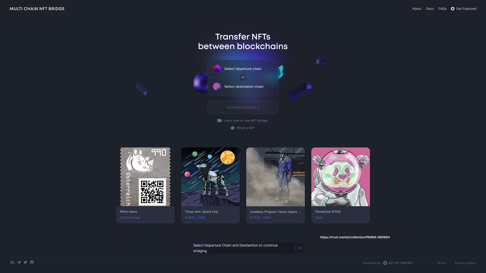
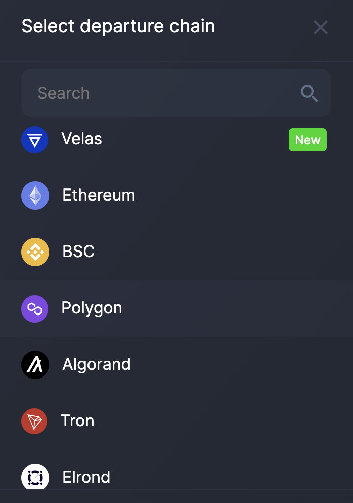
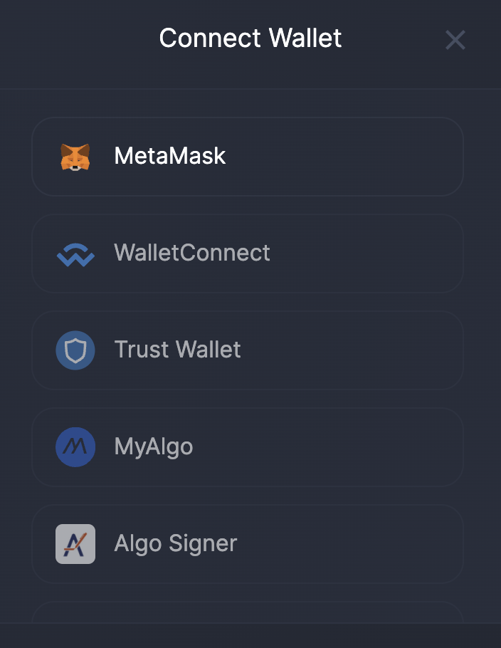
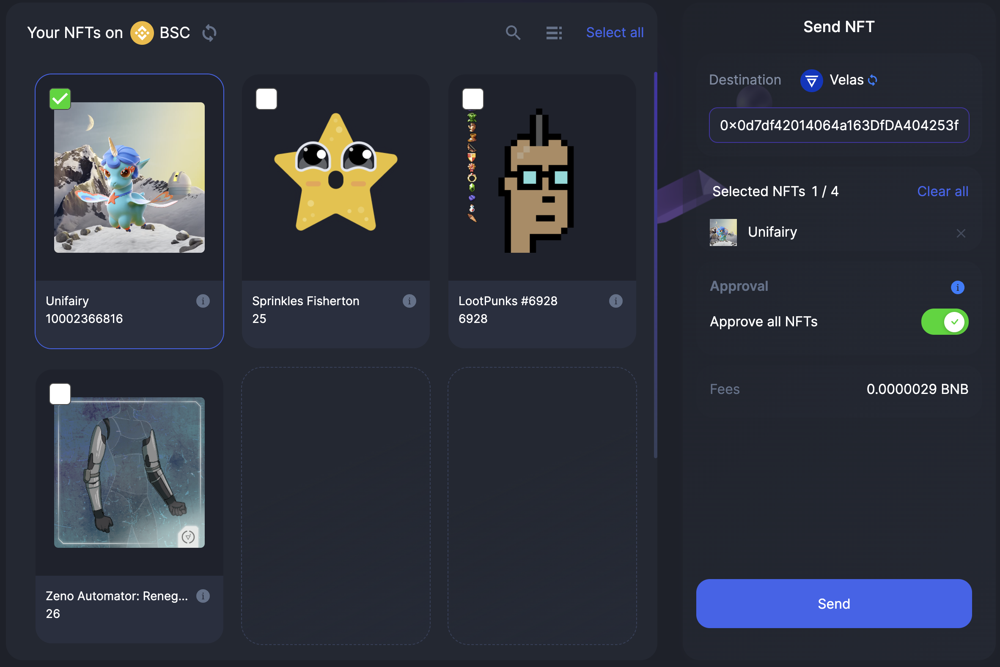

# VeChain General Grant Application Template

## `Project Overview`

- Project: XP Network
- Team Name: XPDIEM FOUNDATION 3 FRASER STREET #05-25 DUO TOWER SINGAPORE
- Payment Address: 0xB3B2E04A117ca510A90A76c28677109D2700b219 (ERC 20 USDT / USDC / BUSD) payment address.

> ⚠️ *The combination of your GitHub account submitting the application and the payment address above will be your unique identifier during the program. Please keep them safe.*

### `Overview`

- The first of the kind [NFT multi-chain bridge](https://bridge.xp.network/) connecting a wide range of EVM to a number of Non-EVM chains. At the moment of writing, the bridge allows transferring NFTs to and from:
  - Ethereum
  - Binance Smart Chain
  - Avalanche
  - Polygon
  - Algorand
  - Fantom
  - Tron
  - Elrond
  - Velas
  - xDai
  - Fuse
- VeChain is an important player in the blockchain industry. It occupies the #33 place in the chain rancking and its token has 0.25% of the market dominance. But much more importantly, VeChain has a rich NFT ecosystem populated with professionally developed Marketplaces, successful NFT projects, talented [Artists](https://twitter.com/VETlieber) and content providers.
- The most prominent NFT Marketplaces are:
  - [World of V](https://marketplace.worldofv.art/)
  - [VeSea](https://vesea.io/)
  - [VPunks](https://vpunks.com/#/)
  - [VimWorld](https://www.vimworld.com/vimmarket)
  - [NFT Paper Project](https://nftpaperproject.com/market)
  - [BlackVeMarket](https://blackvemarket.com/)
- There Are significant NFT projects:
  - [Mad V-Apes](https://twitter.com/MADv_APESnft)
  - [VPunks](https://vpunks.com/#/)
  - [VetPets](https://www.muse.place/vetlieber)
  - [StonerPunks](https://explore.vechain.org/accounts/0x6fcb91e6bdfb3e91bc9d4580759c7dfc1d229a80)
  - [V-Ladies](https://marketplace.worldofv.art/collection/9c64b35a-6560-98f1-35ac-bd006630e21e)
  
  However, they are all detached from the global NFT market and require a gateway for their assets for entering and exiting the blockchain.

   Trade has enriched civilizations with new technologies and discoveries at all times. Asset turnover has always eventually boosted the growth and development of the culture. Human history teaches us that civilizations declined every time the trading routes were cut, and degradation plagued the previously prospering ecosystems. 
   
   The European dark ages is a vivid example of such a decline. During the Hellenistic and Roman periods of cultural abundance, the `Silk Road` was the major cultural highway between the East & the West. In the dark ages, when the unrest in the Middle East cut this route, very few in Europe knew how to read and write.

   On the other hand, trade and financial abundance fuel art & science development. Venice, Florence, and Milan were picturesque illustrations bringing the Renaissance to life when the `spice trade route` became available.

   `XP Network NFT Bridge` is the Silk Road or the Spice trade route of today's NFT industry. We connect the otherwise isolated markets whose potential is limited to the islandic communities of individual chains.


# `Project Details`

Our team has built the bridge from scratch and, therefore, has profound knowledge how the bridge operates. We keep working on hardenning its security, improving the user experience and adding new functionality.

The UI of the bridge is intuitive and does not require additional training. But just in case a user is in doubt, we have recorded a [video](https://www.youtube.com/watch?v=QZvG6MaEdW4) explaining the flow.

## `MOCKUPS:`

1. Initial view of the [bridge](https://bridge.xp.network/#) allows to choose the chains of departure & destination.

2. A useer can chose from a range of EVM and Non-Evm chains by clicking an element of the list or type the name of the chain of interest in the search bar.

3. The wallet selection pop-up window suggests a range of wallets supported by the bridge. The wallets relevant to the departure chain are active and displayed with bright colors. The wallets relevant for other chains are inactive and therefore greyed out.

3. Our NFT-Indexer lists the NFTs a user Owns on the chain of departure



## `API specifications of the core functionality`
  Our JavaScript library allows to use the bridge in the background of any dApp:<br>
  1. To install the latest version of xp.network library:

  ```bash
  yarn add "git+https://github.com/xp-network/xpjs#master-dist"
  ```
  2. Importing dependencies
   ```javascript
   import {
     ChainFactoryConfigs,  ChainFactory,
     ElrondHelper,         ElrondParams,
     TronHelper,           TronParams,
     Web3Helper,           Web3Params,
   } from "xp.network/dist";

   // Chanin name to chain nonce mapper:
   import { Chain, Config } from "xp.network/dist/consts";

   // Instantiate the chain factory for the
   // MAINNET
   const mainnetConfig = ChainFactoryConfigs.MainNet();
   const factory = ChainFactory(Config, mainnetConfig);
   // or
   // TESTNET (uncomment if you want to try in the testnet)
   // const testnetConfig = ChainFactoryConfigs.TestNet();
   // const factory = ChainFactory(Config, testnetConfig);
   ```
  3. Getting the signer object
   ```typescript
   // EVM chains compatible signer:
   import ethers from 'ethers';
   const signer = (new ethers.providers.Web3Provider(window.ethereum)).getSigner();
   ```
  4. Getting the inner chain objects
   ```javascript
   (async () => {
   // EVM-compatible chains:
   const ethereum  = await factory.inner<Web3Helper,     Web3Params>  (Chain.ETHEREUM);
   const bsc       = await factory.inner<Web3Helper,     Web3Params>  (Chain.BSC);
   const polygon   = await factory.inner<Web3Helper,     Web3Params>  (Chain.POLYGON);
   const avax      = await factory.inner<Web3Helper,     Web3Params>  (Chain.AVALANCHE);
   const fantom    = await factory.inner<Web3Helper,     Web3Params>  (Chain.FANTOM);
   const xdai      = await factory.inner<Web3Helper,     Web3Params>  (Chain.XDAI);
   const velas     = await factory.inner<Web3Helper,     Web3Params>  (Chain.VELAS);

   //TODO:
   const vechain  = await factory.inner<Web3Helper,     Web3Params>  (Chain.VECHAIN);

   // Non-EVM chains:
   const algorand  = await factory.inner<TronHelper,     TronParams>  (Chain.ALGORAND);
   const elrond    = await factory.inner<ElrondHelper,   ElrondParams>(Chain.ELROND);
   const tezos     = await factory.inner<TronHelper,     TronParams>  (Chain.TEZOS);
   const tron      = await factory.inner<TronHelper,     TronParams>  (Chain.TRON);
   })();
   ```
  5. Listing NFTs
   ```javascript
   (async () => {
     const web3Nfts = await factory.nftList(
       vechain,     // The chain of interest
       "0x...."     // The public key of the NFT owner in a web3 chain
     );
   })();
   ```
  6. Approving
  ```js
  (async () => {
    const isApproved = await vechain.approveForMinter(web3ChosenOne, signer);
    console.log("Is Approved:", isApproved);
  })();
  ```
  7. Transferring an NFT
  ```javascript
   // EVM compatible chains example:
   (async () => {
     const web3Result = await factory.transferNft(
       vechain,                    // The Source Chain.
       ethereum,                   // The Destination Chain.
       theChosenOne,               // Or the NFT object you have chosen from the list.
       signer,                     // The web3 signer object (see p. 3.2 above).
       "ADDRESS OF THE RECEIVER"   // The address whom you are transferring the NFT to.
     );
     console.log(web3Result);
   })();
  ```

## `Tech Stack`:
  
| Bridge Component | Stack |
| :-: | :-: |
| Smart Contracts | Solidity |
| Validators | TypeScript |
| Backend | TypeScript |
| Frontend | React (JSX, TypeScript) |
  
## `Bridge Protocol`:
  
  Back in 1943, Warren McCulloch and Walter Pitts published a fundamental paper on state machines – abstract devices that are always in one (and only one) out of a set number of stable states, depending on their previous state and on the inputs they receive. The paper describes several types of such finite-state machines:

  **Acceptors** can either accept an input or not<br>
  **Recognizers** can recognize an input or not<br>
  **Transducers** can generate output from a given input<br>
  The concept of finite-state machines can be applied to the XP.network bridge validators:

  Bridge relay validators have a finite set of states `S = {s1 … ss}` - [idle, handling an event, paused, signing a transaction, reverting a transaction]

  There is a finite finite set of inputs that a validator can receive: either events broadcast by the smart contracts or results of computations (inputs `I = {i1 … iJ}`)

  There is also a finite set of output symbols `O = {o1 … oo}` - [none, signature, smart contract address, +/- Validator credential`s]
  States and inputs are mapped onto the so-called state transition function to determine the next state: `I x S → S’`

  Inputs and states are also mapped onto the output function to determine the output: `I x S -> O`

  The table below synthesizes all the possible combinations of validator states, inputs, outputs, and resulting states that can be produced. Each of these combinations corresponds to one of the state machine types: acceptor, recognizer, or transducer.

  Current State (Sx) |	Input (Ix) |	Output (Ox)	 | Next State (S’)
  |:---:|:---:|:---:|:---:|
  |Validator as a Recognizer|
  Idle (listening)|	Unrecognized event|	none	|Idle (listening)
  Idle (listening)|	Recognised event  |none	|HandleEvent
  |Validator as a Transducer|
  HandleEvent|	TransferUnique|	none|	SignTransaction
  HandleEvent|	WhitelistNft|	+1 SC address|	Idle (listening)
  HandleEvent|	PauseBridge|	none|	Paused
  Paused|	UnpauseBridge|	none|	Idle (listening)
  HandleEvent|	AddValidator|	+1 Validator|	Idle (listening)
  HandleEvent|	RemoveValidator|	-1 Validator|	Idle (listening)
  SignTransaction|	Error|	none|	RevertTransaction
  SignTransaction|	Success|	PK signature|	Idle (listening)
  RevertTransaction|	none|	PK signature|	Idle (listening)

  A validator’s on-chain multisignature element resides in the bridge smart contract and acts as an acceptor FSM under the control of the bridge validators. The result largely depends on how many validator signatures for a certain transaction have been collected:

  Current State (Sx)|	Input (Ix)|	Output (Ox)|	Next State (S’)
  |:---:|:---:|:---:|:---:|
  Idle (listening)|	none|	none|	Idle (listening)
  Idle (listening)|	Signatures < BFT threshold|	none|	Calculate BFT Threshold
  Calculate BFT Threshold|	Signatures < BFT threshold|	none|	Calculate BFT Threshold
  Calculate BFT Threshold|	Signature >= BFT threshold|	Release NFT to the destination account|	Idle (listening)

  Since the flow of the bridged blockchain events is theoretically unlimited, the entire bridge can be represented as a Turing machine, or a finite-state machine with unlimited memory. This Turing machine reacts to the never-ending string of inputs in the form of events. In turn, bridged blockchains can be described as communicating vessels: if the number of tokens diminishes in one of the vessels, they ought to appear in the same volume and with the same characteristics in the other.
### [`Bridge Security (link)`](https://docs.xp.network/docs/Whitepaper2.0/bridge-security)


## `Team readiness`
The currently functioning [NFT Bridge](https://bridge.xp.network/) is a living example of the team's maturity and readiness for integrating VeCahin to the global NFT family.
  

## `Ecosystem Fit`
Cross-chain bridging is one of the most active areas of blockchain development at the moment, but few projects focus on NFT bridges. Even those that do support only a limited number of chains. The most prominent existing solutions include:

| Project| Supported chains	| Live |
| :-------------: |:-------------:| :-----:|
| AnySwap	| Ethereum & Fantom	| Testnet only|
| PolyBridge |	Ethereum, BSC, HECO, Palette, OKExChain & Polygon |	Yes
| Efinity	| Ethereum & Enjin (a Polkadot parachain) |	No
| Solana Wormhole |	Ethereum, Solana |	Yes
| NFT OmniBridge |	xDAI, Ethereum |	Early beta
| SeaScape	| BSC, Moonbeam, Rinkeby testnet |	Yes

`Competitive Advantages`
Compared to all the bridging solutions described above, XP.network has a number of important advantages:

1) The first bridge designed exclusively for NFTs, tackling every aspect of asset transition and compatibility across multiple protocols;<br/>
2) A much wider range of supported blockchains: any chain can be connected to the bridge;<br/>
3) Linking EVM to a range of non-EVM chains with fundamentally different tech stacks, such as Elrond, Solana, Cardano, Algorand, etc.<br/>
4) A simple and seamless UI for minting, transfering, and exploring NFTs;<br/>
5) Attractively low transaction fees, payable in the currency of the origin blockchain (ETH, BNB, SOL etc.);<br/>
6) Highly scalable: the capacity of the bridge is limited only by the TPS of the bridged chains;<br/>
7) Possibility to mint NFTs on multiple chains from an easy-to-use UI;<br/>
8) Superior security and reliability: a multilayer security system capable of preventing all common types of attacks, with no single points of failure;<br/>
9) A more versatile technological stack, and provide the same level of security and reliability;<br/>
10) Possibility to integrate the bridge with any NFT dApp, allowing users to trade and exchange NFTs the way they are used to, while the bridge operates behind the scenes.<br/>
11) Possibility of transferring NFTs in Batches<br>
12) Possibility of transferring NFT smart contract logic<br>
13) Option of choosing the smart contract to mint wrapped NFTs with on the target chain<br>

## `Team`

### Team members

[XP Network Team](https://xp.network/team/)

- [Dima Briukhanov](https://github.com/dima-brook) CTO
- [Rupansh Sekar](https://github.com/rupansh) Blockchain Developer
- [Sumit Kumar](https://github.com/imsk17) Blockchain Developer
- [Xueming Zheng](https://github.com/rocalex) Blockchain Developer
- [Yura Dukhno](https://github.com/YuraDQuigon) Front-End Developer
- [Alexey Adoniev](https://github.com/AlexeyAdoniev) FullStack Developer

### `Team Website`

- [XP Network Website](https://xp.network/)

### `Team's experience`

Our teams has already bridged 10+ chains. For many chains our bridge is the only one allowing to transfer NFTs:
  - Ethereum
  - Binance Smart Chain
  - Avalanche `(No other NFT bridge, but XP Network)`
  - Polygon
  - Algorand `(No other NFT bridge, but XP Network)`
  - Fantom
  - Tron `(No other NFT bridge, but XP Network)`
  - Elrond `(No other NFT bridge, but XP Network)`
  - Velas `(No other NFT bridge, but XP Network)`
  - xDai `(No other NFT bridge, but XP Network)`
  - Fuse `(No other NFT bridge, but XP Network)`

We have finished works on integrating Tezos & Solana.<br>
For Tezos our bridge will be the only one supporting NFTs.

### Team Code Repos

- [XP Network GitHub repository](https://github.com/XP-NETWORK)
- [XP Network Brige JavaScrip library](https://github.com/XP-NETWORK/xpjs)
- [The Bridge Interface](https://github.com/XP-NETWORK/bridge-interface)
- [Smart Contracts Audits](https://github.com/XP-NETWORK/audits)
- The key repos are private & can be shared with the VeChain Team

### Team LinkedIn Profiles

- [Dima Briukhanov - CTO](https://www.linkedin.com/in/dmitry-briukhanov-60b2ab45/)
- [Rupansh Sekar Blockchain](https://www.linkedin.com/in/rupansh-sekar-10941b16a/)
- [Sumit Kumar - Blockchain](https://www.linkedin.com/in/imsk17/)
- [Xueming Zheng - Blockchain](https://www.linkedin.com/in/xuemingzheng/)
- [Yura Dukhno - FE](https://www.linkedin.com/in/yuradukhno/)
- [Alexey Adoniev - FS](https://www.linkedin.com/in/alex-adoniev-a04022176/)

## Development Roadmap 

  - Deployemnt of the bridge smart contracts on VeChain, 
  - Launching the full node of VeChain,
  - Running the NFT-Indexer
  - Integrating the transaction fee estimator
  - Integrating VeChain in the fee conversion tool
  - Adding VeChain to the bridge relay validators scope
  - Integrating VeChain in the Bridge's UI

<br>

#### `Overview`

|  | Milestone 1 |  | Total |
| - | - |- | - |
| Estimated Duration | 14 d |  | 14 d |
| Full-time equivalent (FTE) | 28 | | 28 |
| Cost (up to $ 30,000) | $ 30,000 |  | $ 30,000|

<br>

#### `Milestone 1` — Smart Contract, Validators, Backend & UI

| Number | Deliverable | Specification |
|-|-|-|
| 0a.| License | Apache 2.0 / MIT / Unlicense |
| 0b. | Documentation | We will provide both inline documentation of the code and a basic tutorial that can interact with the deployed smart contracts and backend service. |
| 0c. | Testing Guide | The code will have proper unit-test coverage 85% to ensure functionality and robustness. In the guide, we will describe how to run these tests |
| 1 | Smart Contracts | We will develop smart contracts that will:<br>1. Support ERC-721<br>2. Support ERC-1155<br>3. Freeze/Unfreeze Native NFTs<br>4. Mint/Burn wrapped NFTs<br>5. Pay the TX fees on the target chain in native tokens<br>6. Send / Receive NFTs in batches |
| 2 | Validators | 1. Setting up the VeChain Node for listening to the events<br>2. Adding the logic to the validators |
| 3 | Backend | Integration of VeChain in the:<br>1. NFT Index<br>2. TX Fee Estimator<br>3. Crypto-currency converter |
| 4 | Frontend | Integration of VeChain in the:<br>1. User Interface<br> 2. Wallets (Metamask, TrustWallet, WalletConnect) |


#### `Community engagement`

As part of the Program we will produce and publish at least one article/tutorial. It will explain the work done as part of the grant.

## `Future Plans`

Our long term plans include:
1. Mainnet integration to Cardano, Solana, Polkadot ecosystem, Cosmos ecosystem, EOS compatible chains, NEO
2. Forged NFT detection on all the bridged chains
3. NFT explorer for finding NFT’s with deleted storage
4. NFT meta backup to secure transactions
5. Distributed NFT’s hosting (better than IPFS)
6. NFT Search (search by any parameter)
7. Retention protection tool

## `Additional Information`

Any additional information that you think is relevant to this application that hasn't already been included.

Possible additional information to include:
- By the time of writing 10+ blockchains have been successfully bridged.
- We already received grants for integrating Velas & Fuse. Tezos has funded our integration and partially covered the smart contract auditing costs.
- We applied for grants on Velas & Fuse.
